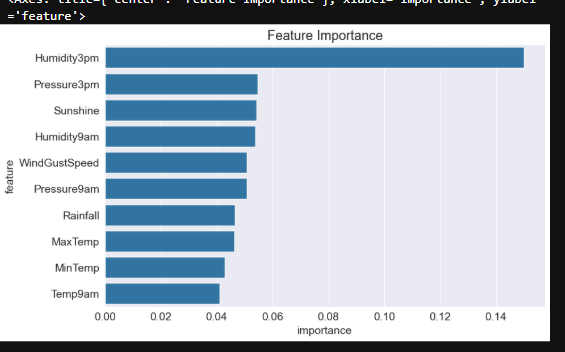

# Rain Prediction — Australia Weather Dataset

Predicting next-day rain (`RainTomorrow`) using historical Australian weather observations.

## Problem

Given a day's weather readings (temperature, humidity, pressure, wind, sunshine, etc.), predict whether it will rain the next day. This is a binary classification problem with real-world utility: helping people decide whether to plan for rain.

## Dataset

- Source: "Rain in Australia" weather dataset
- Target: `RainTomorrow` (Yes/No)
- Class distribution: ~78% No / ~22% Yes — a meaningfully imbalanced dataset, which shaped the modeling approach below.

## Approach

1. **Baseline model** — trained a `RandomForestClassifier` on the full feature set.
2. **Evaluation beyond accuracy** — accuracy alone is misleading here, since always predicting "No rain" would already score ~78%. Evaluated instead with precision, recall, F1 (per class), and ROC-AUC.
3. **Threshold tuning** — the default 0.5 classification threshold favored the majority class, catching only 48% of actual rain days (recall). Swept thresholds from 0.3–0.5 and selected **0.35** as the operating point: it raises recall on rain days from 0.48 → 0.66 while accuracy drops only 1 point (0.85 → 0.84) and macro F1 actually improves (0.75 → 0.77).
4. **Feature importance** — examined which features the model relies on most, to sanity-check that it learned genuine weather signal rather than noise.

## Results

| Metric | Default (0.5) | Tuned (0.35) |
|---|---|---|
| Accuracy | 0.85 | 0.84 |
| Precision (Yes) | 0.76 | 0.63 |
| Recall (Yes) | 0.48 | 0.66 |
| F1 (Yes) | 0.59 | 0.65 |
| Macro F1 | 0.75 | 0.77 |

**ROC-AUC: 0.872** — indicates strong underlying class separation, independent of the chosen threshold.

### Why 0.35, not the default 0.5 or a more aggressive threshold like 0.3?

For a weather-prediction use case, missing an actual rain day (a false negative — telling someone it's dry when it isn't) is generally more costly than a false alarm (suggesting an umbrella on a day that turns out dry). The 0.35 threshold was chosen because it meaningfully improves recall on rain days over the default, without the accuracy and precision trade-offs becoming as steep as they are at 0.3.

### Feature importance

`Humidity3pm` is the single strongest predictor, consistent with meteorological understanding — afternoon humidity is a well-known precursor to rain. The next tier (`Pressure3pm`, `Sunshine`, `Humidity9am`, `WindGustSpeed`, `Pressure9am`) are also physically sensible drivers of rain formation, giving confidence the model learned real signal rather than overfitting to noise.

## What I'd improve next

- Try `class_weight='balanced'` or SMOTE and compare against threshold tuning as an alternative way to address the imbalance.
- Try a gradient-boosted model (XGBoost/LightGBM) as a stronger baseline than Random Forest.
- Cross-validate the threshold choice rather than selecting it from a single test split.

## Tech stack

Python, pandas, scikit-learn (RandomForestClassifier), matplotlib/seaborn for visualization.
